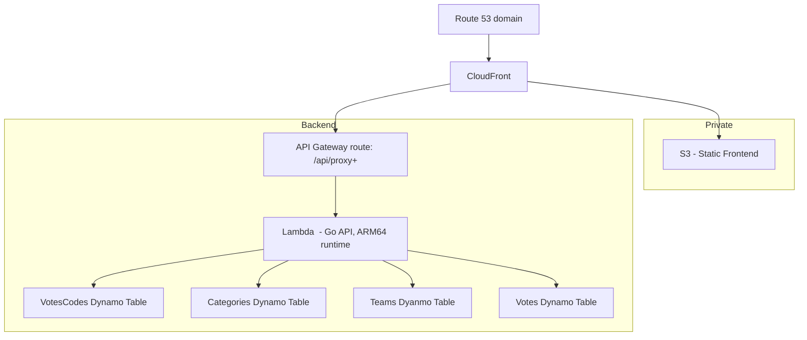

## Why this?
Recently I offered my help in organizing the current company's yearly hackathon and the team asked me to deal with the voting system.
I wanted to move away from the classic _Excel spreadsheet + Google Form_.

## What is it?
This is a simple,_yet challenging_, project I decided to implement in my spare time to deal with the voting problem. 

The idea was to create a **simple voting system**
* Only **1 vote per person** - using a unique `voting code` to stop dupe voting
* Have a very `simple and intuitive` UI
* Each code has a `weight` - this was a requirement: the `grand_jury` vote has more weight than the `other_team` or `general_public`
* Another requirement was for _people to vote for all teams, and rate them under categories_
  * So, I decided to use a `5-star` system for each team for each category
  * This allows me to apply weights to each category - _maybe presentation is more important than fun?_

The simple UI (not connected to any API and with code validation disabled) can be found here(todo - link)

## The API
The voting UI uses a few simple API requests that should be public.
* `POST : /api/vote` - register a new vote
* `GET : /api/codes/{code}` - validate the code before voting 
* `GET : /api/results` - display the results
* `GET : /api/meta/categories` - get the categories for the voting
* `GET : /api/meta/teams` - get the teams and details

On top of these, I decided to create some private endpoints - available only in `swagger` running from my machine on the day of voting.
These are only here to do maintenance and manual intervention and should not be on a critical path. 

Also, in a real-world scenario, these should be more protected (having only a simple API key right now, as an example).

Of course, a real API should be versioned as well.

### Admin Group
The admin group is used to manage the initial voting codes.
* `POST : /api/admin/codes` - private - create new codes (bulk) by category
* `GET : /api/admin/codes` - private - get all the codes
* `GET : /api/admin/codes/{category}` - private - get all the codes for category
* `DELETE : /api/admin/codes/{code}` - private - delete a specific code
* `POST : /api/admin/codes/{code}/reset` - private - reset a code to unused
* `POST : /api/admin/codes/reset` - private - reset all codes to unused

### Meta: Voting categories
The Voting Categories are used to manage the categories where the teams will be voted for. This is displayed on the UI.
* `GET : /api/meta/categories` - public - (ui uses this)
* `GET : /api/meta/categories/{ID}` - private -
* `POST : /api/meta/categories` - private - 
* `PUT : /api/meta/categories/{ID}` - private -
* `DELETE : /api/meta/categories/{ID}` - private -

### Meta: Teams
The Teams group is used to manage the teams (and its members)
* `GET : /api/meta/teams` - public - (ui uses this)
* `GET : /api/meta/teams/{ID}` - private -
* `POST : /api/meta/teams` - private -
* `PUT : /api/meta/teams/{ID}` - private -
* `DELETE : /api/meta/teams/{ID}` - private -

## AWS
To keep the costs at a minimum and because I am dealing with around 100 - 200 burst requests I decided to use the following components
* `Route53` - already had a domain hosted here
* `CloudFront` and `S3` - to host the static element. 
* `DynamoDB` tables with very simple structure
  * _VotingCodes_ - holds the actual voting codes, has string PK on the code itself
  * _VotingCategories_ - holds the voting categories, ID int PK
  * _Teams_ - same as above but for teams
  * _Votes_ - a bit more complicated table, PK string with voting code, and a composite SK(SortKey)
    * `SortKey:    fmt.Sprintf("cat#%d#team#%d", v.CategoryID, v.TeamID),`
    * `PK: voting code`
    * This way, it is very easy to retrieve values
    * (add image)
* `Lambda function` to host the API written in `golang`
  * The lambda should be sufficient for approximately 200 burst requests
  * I picked ARM runtime because it is the cheapest
  * _Alternative: SQS queue + second lambda_ - This allows for a decoupled approach, introduces retries. Overkill for this exercise. 
* `API Gateway` with Lambda integration to expose the API inside the program.



## The code
The project, while could be a lot better, is simple 
* An `api package` that contains _controllers_, _models_, _transport_ and some _config_. 
  * There are integration tests inside
* A `logging package` because I like to log things
* A `storage package` to deal with repositories and dynamo impl. 
* `Swagger docs` for all endpoints - I want to run this locally to set things up.
* A `docker-compose` file
  * The idea is to use `localstack` to run the integration tests (and not using AWS credits)
  * Using `localstack + docker` you can run dynamo, S3, etc, locally in docker
  * More about localstack [here](https://docs.docker.com/guides/localstack/)
* The docker compose file also uses the `init-localstack.sh` file that does 2 simple things
  * Creates the needed dynamo tables
  * Creates a needed S3 bucket 
  * Waits for everything to be ready before finishing
* Lastly, a `makefile` to help with automation
  * For example, the lambda uses an `ARM runtime`, the makefile has a target inside to create the required zip file
  * Check the file for additional targets


### How to run this locally?
Use the makefile targets, for example, `make run-local` will build, generate swagger, start localstack (needs docker running), run the tests, start the app. 

## The vote process
We have 3 categories of voters:
* `grand_jury` with a weight of **0.5**
* `other_team` with a weight of **0.3**
* `general_public` with a weight of **0.2** 

We also define voting categories with each own weights. Let's consider the below as demo purposes only. 
* `presentation` with a weight of **0.5**
* `innovation` with a weight of **0.4**
* `fun` with a weight of **0.1**

Let's assume we have 2 teams: `teamA` and `teamB`

There are `5 voters`: 2 grand_jury, 2 other_team and 1 general_public

> The front-end requires that all voters cast their vote on all teams and all categories so the importance of the voter gets distributed.

## Voting Score Calculation

Each vote is cast by a user for **every team** across **all categories**. The final team score is computed by averaging the **weighted score** in each category.

### Computation Formula

Each individual vote contributes:

```
weighted_score = rating × voter_weight × category_weight
```

Where:
- `rating` is between 1–5
- `voter_weight` depends on the voting group (e.g., `grand_jury = 1.25`, `other_team = 1.0`, `general_public = 0.75`)
- `category_weight` is configured per category (e.g., `presentation = 0.4`, `execution = 0.6`)

### Example

Assume:
- Voter `A` from `grand_jury`
- Category weights:
  - Cat1 = 0.4
  - Cat2 = 0.6
- Voter `A` rates `Team X`:
  - 4 stars in Cat1
  - 5 stars in Cat2

Then:
```
Cat1 Score = 4 × 1.25 × 0.4 = 2.0
Cat2 Score = 5 × 1.25 × 0.6 = 3.75
Total Score = 2.0 + 3.75 = 5.75 (across 2 categories)
Normalized = 5.75 / 2 = 2.875
```

If multiple voters submit ratings, the score per category is **averaged**, then all category averages are summed for the final team score.